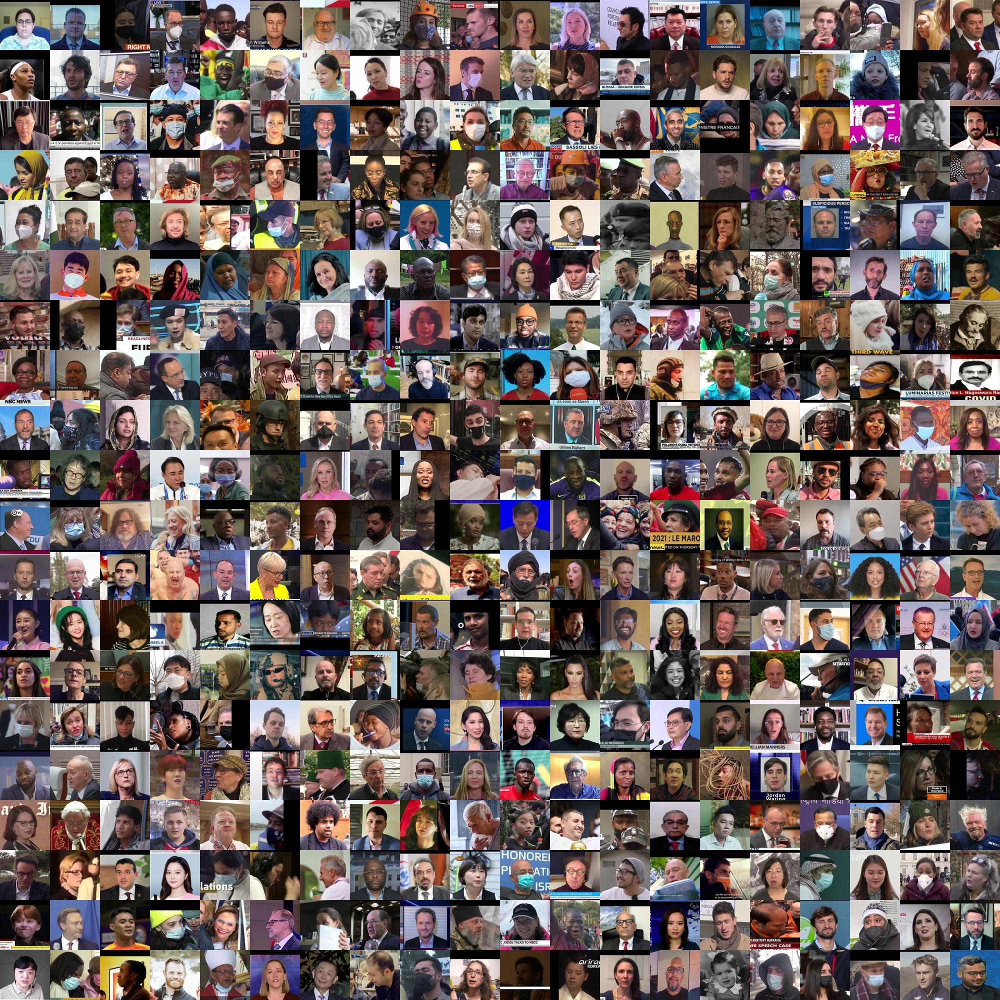
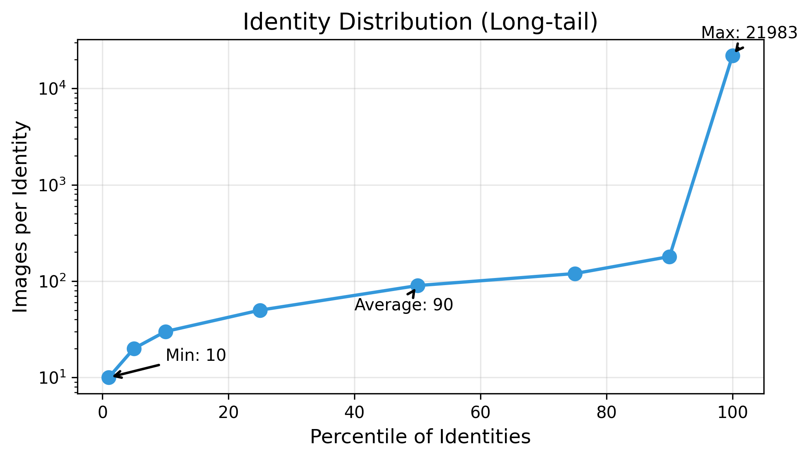
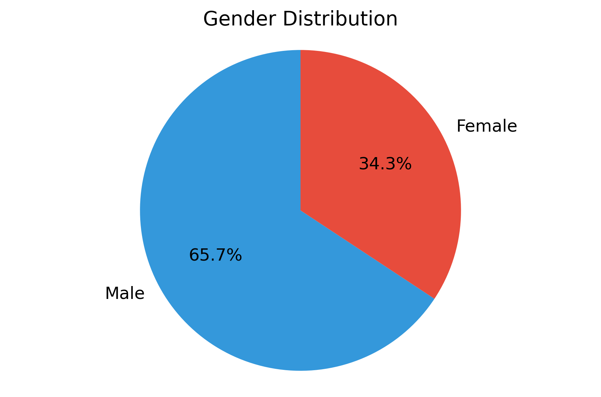
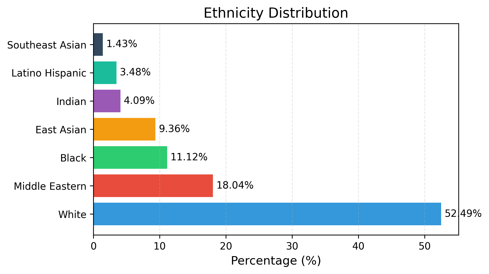
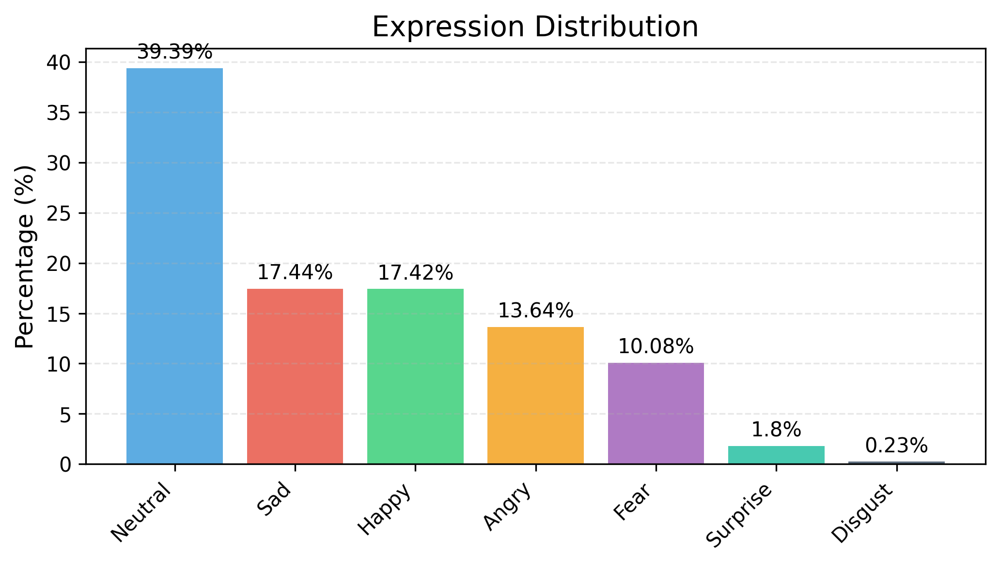
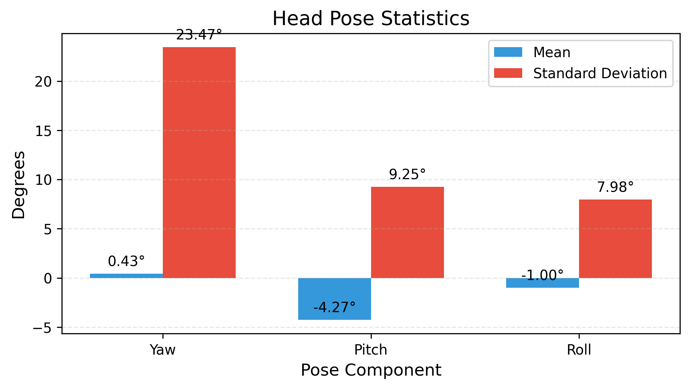

# TVFace Dataset
**Large-Scale Facial Clustering & Recognition Dataset**

Journal Article · [Dataset (Google Drive)](https://drive.google.com/drive/folders/1GBJs96fE6qbef8VGurz4q3DvN4s_pXDw?usp=sharing)

[](https://creativecommons.org/licenses/by-nc/4.0/)
[](https://doi.org/10.1007/s10044-025-01464-3)

<p align="center">
  
</p>

## Overview

TVFace is the largest publicly available facial recognition dataset featuring **2.6 million+ images** of **28,955 unique individuals** extracted from global television broadcasts. Designed to advance research in unsupervised facial clustering, large-scale recognition, and demographic fairness analysis, this dataset captures real-world variations in pose, lighting, expression, and aging effects across diverse demographics.

## Key Features

- **Unprecedented Scale**: 2,609,210 high-resolution face images
- **Demographic Diversity**: Balanced representation across 7 ethnic groups and 8 age categories
- **Rich Annotations**: Probabilistic labels for age, gender, ethnicity, expression, and head pose
- **Real-world Variations**: Temporal changes, pose diversity, and broadcast-quality images
- **Long-tail Distribution**: Natural identity distribution from 10 to 21,983 images per person
- **Benchmark Ready**: Standardized evaluation protocols for clustering and recognition tasks

## Dataset Statistics

| Category | Details |
|----------|---------|
| **Total Images** | 2,609,210 |
| **Unique Identities** | 28,955 |
| **Avg. Images/Identity** | 90 |
| **Resolution** | 224×224 pixels |
| **Ethnic Groups** | 7 (White, Black, East Asian, Middle Eastern, Indian, Latino, SE Asian) |
| **Age Groups** | 8 (0-2 to 70+) |
| **Expressions** | 7 categories with confidence scores |

<div align="center">
  
</div>

## Demographic Distribution

<table>
<tr>
<td width="45%">

| **Gender** | Count | Percentage |
|------------|-------|------------|
| Male | 1,714,636 | 65.71% |
| Female | 894,574 | 34.29% |

</td>
<td width="55%">

</td>
</tr>
</table>

<table>
<tr>
<td width="50%">

| **Ethnicity** | Count | Percentage |
|---------------|-------|------------|
| White | 1,369,323 | 52.49% |
| Middle Eastern | 470,658 | 18.04% |
| Black | 290,143 | 11.12% |
| East Asian | 244,298 | 9.36% |
| Indian | 106,753 | 4.09% |
| Latino Hispanic | 90,758 | 3.48% |
| Southeast Asian | 37,277 | 1.43% |

</td>
<td width="50%">

</td>
</tr>
</table>

## Expression Distribution

<table>
<tr>
<td width="50%">

| **Expression** | **Count** | **Percentage** | **Avg. Confidence** |
|----------------|-----------|----------------|---------------------|
| Neutral | 1,048,995 | 39.39% | 0.790 |
| Sad | 464,547 | 17.44% | 0.684 |
| Happy | 464,049 | 17.42% | 0.867 |
| Angry | 363,260 | 13.64% | 0.717 |
| Fear | 268,530 | 10.08% | 0.674 |
| Surprise | 47,920 | 1.8% | 0.716 |
| Disgust | 6,072 | 0.23% | 0.640 |

</td>
<td width="50%">

</td>
</tr>
</table>

## Head Pose Statistics

<table>
<tr>
<td width="50%">

| **Pose Component** | **Mean (degrees)** | **Std Dev (degrees)** | **Characteristics** |
|--------------------|--------------------|-----------------------|---------------------|
| Yaw (Left-Right) | 0.43 | 23.47 | Wide variation, all angles |
| Pitch (Up-Down) | -4.27 | 9.25 | Slight downward (camera angle) |
| Roll (Tilt) | -0.997 | 7.98 | Nearly level, small variations |

</td>
<td width="50%">

</td>
</tr>
</table>

## Directory Structure

```
tvface_dataset/
├── by_label/
│   ├── 0/
│   │   ├── abcnews_frame_20211215180237107908_face_0.jpg
│   │   └── ...
│   ├── 1/
│   │   └── ...
│   └── .../
├── annotations/
│   ├── annotations.json
│   ├── demographic_summary.csv
│   └── clustering_ground_truth.csv
├── splits/
│   ├── clustering_images.txt
│   └── train_val_test_splits.txt
└── evaluation_scripts/
    ├── clustering_metrics.py
    └── demographic_analysis.py
```

## Data Format

### Image Organization
- **Identity Folders**: Each folder (0, 1, 2, ...) contains all images for a specific identity
- **Image Format**: JPEG with RGB color space, 224×224 pixels
- **Quality**: 95% JPEG quality with minimal compression artifacts
- **Naming Convention**: Descriptive names preserving source information

### Annotation Format (annotations.json)

```json
{
  "labels": {
    "abcnews_frame_20211215180237107908_face_0": {
      "label": 83,
      "mask": 0.0,
      "attributes": {
        "age": {
          "0-2": 0.0,
          "3-9": 0.0,
          "10-19": 0.0,
          "20-29": 0.0,
          "30-39": 0.0,
          "40-49": 0.01,
          "50-59": 0.18,
          "60-69": 0.68,
          "70+": 0.13
        },
        "gender": {
          "Male": 1.0,
          "Female": 0.0
        },
        "race": {
          "White": 0.38,
          "Black": 0.0,
          "Latino Hispanic": 0.0,
          "East Asian": 0.0,
          "Southeast Asian": 0.0,
          "Indian": 0.0,
          "Middle Eastern": 0.61
        },
        "expression": {
          "angry": 0.08,
          "disgust": 0.01,
          "fear": 0.14,
          "happy": 0.0,
          "sad": 0.63,
          "surprise": 0.0,
          "neutral": 0.13
        },
        "pose": {
          "yaw": -3.26,
          "pitch": -4.65,
          "roll": -0.83
        }
      }
    }
  }
}
```

### Annotation Schema

| **Field** | **Description** | **Type** |
|-----------|-----------------|----------|
| `label` | Identity cluster label | Integer |
| `mask` | Exclusion flag (0.0 = include, 1.0 = exclude) | Float |
| `age` | Probability distribution over age groups | Dict[str, float] |
| `gender` | Gender probabilities | Dict[str, float] |
| `race` | Ethnicity probabilities | Dict[str, float] |
| `expression` | Expression probabilities | Dict[str, float] |
| `pose` | Head pose angles in degrees | Dict[str, float] |

## Getting Started

### Installation

```bash
git clone https://github.com/zaineli/TVFace.git
cd TVFace-Dataset
pip install -r requirements.txt
```

### Data Loading

```python
from tvface_dataset import TVFaceDataset
import torchvision.transforms as transforms
import json

# Load dataset with transforms
transform = transforms.Compose([
    transforms.Resize((256, 256)),
    transforms.ToTensor(),
    transforms.Normalize(mean=[0.485, 0.456, 0.406], 
                        std=[0.229, 0.224, 0.225])
])

dataset = TVFaceDataset(
    img_dir='path/to/tvface_dataset',
    annotation_path='path/to/annotations.json',
    transform=transform
)

# Get sample with annotations
sample = dataset[0]
print(f"Image shape: {sample['image'].shape}")
print(f"Identity label: {sample['label']}")
print(f"Gender: {sample['gender']}")
print(f"Race: {sample['race']}")
print(f"Expression: {sample['expression']}")
```

### Accessing Demographic Statistics

```python
from compute_statistics import compute_statistics
from tvface_dataset import TVFaceDataset
import torchvision.transforms as T

# Initialize dataset
transform = T.Compose([T.ToTensor()])
dataset = TVFaceDataset(
    img_dir='path/to/tvface_dataset',
    annotation_path='path/to/annotations.json',
    transform=transform
)

# Compute statistics
stats = compute_statistics(dataset)

# Print results
print("=== Age Distribution ===")
for k, v in stats['age_distribution'].items():
    print(f"{k}: {v} ({v/len(dataset)*100:.2f}%)")

print("\n=== Gender Distribution ===")
for k, v in stats['gender_distribution'].items():
    print(f"{k}: {v} ({v/len(dataset)*100:.2f}%)")
```

### Working with Identity Clusters

```python
import json
from collections import defaultdict

# Load annotations
with open('tvface_dataset/annotations/annotations.json', 'r') as f:
    annotations = json.load(f)

# Group images by identity
identity_clusters = defaultdict(list)
for image_id, data in annotations['labels'].items():
    if data['mask'] == 0.0:  # Include only valid images
        identity_clusters[data['label']].append(image_id)

# Analyze cluster sizes
cluster_sizes = [len(images) for images in identity_clusters.values()]
print(f"Total identities: {len(identity_clusters)}")
print(f"Average cluster size: {sum(cluster_sizes) / len(cluster_sizes):.1f}")
print(f"Largest cluster: {max(cluster_sizes)} images")
print(f"Smallest cluster: {min(cluster_sizes)} images")
```

## Evaluation Metrics

### Clustering Evaluation

```python
from evaluation_scripts.clustering_metrics import evaluate_clustering

# Example usage
true_labels = [0, 0, 1, 1, 2, 2]
pred_labels = [0, 0, 1, 2, 2, 2]

metrics = evaluate_clustering(true_labels, pred_labels)
print(f"NMI: {metrics['NMI']:.4f}")
print(f"ARI: {metrics['ARI']:.4f}")
print(f"Purity: {metrics['Purity']:.4f}")
print(f"Homogeneity: {metrics['Homogeneity']:.4f}")
print(f"Completeness: {metrics['Completeness']:.4f}")
```

### Demographic Fairness Analysis

```python
from evaluation_scripts.demographic_analysis import analyze_fairness

# Analyze performance across demographic groups
fairness_report = analyze_fairness(
    predictions=pred_labels,
    ground_truth=true_labels,
    demographics=demographic_data
)

print("Performance by Gender:")
for gender, metrics in fairness_report['gender'].items():
    print(f"  {gender}: NMI={metrics['NMI']:.3f}, ARI={metrics['ARI']:.3f}")
```

## Dataset Challenges and Applications

<table>
<tr>
<td width="50%">

### Key Challenges
- **Scale**: Efficiently processing 2.6M+ images
- **Long-tail Distribution**: Handling clusters ranging from 10 to 21,983 images
- **Temporal Variations**: Same individuals across multiple years
- **Pose Diversity**: Full 360° coverage with professional TV angles
- **Demographic Fairness**: Ensuring equitable performance across all groups

</td>
<td width="50%">

### Research Applications
- **Unsupervised Face Clustering**: Organize large-scale unlabeled face datasets
- **Face Recognition**: Train and evaluate recognition systems
- **Demographic Bias Analysis**: Study fairness across different groups
- **Temporal Face Analysis**: Research aging effects and temporal consistency
- **Large-scale Retrieval**: Develop efficient face search systems

</td>
</tr>
</table>

## Ethical Considerations

TVFace is intended for **research purposes only**. Users must adhere to:

- **Privacy Protection**: Implement appropriate anonymization procedures
- **Non-commercial Use**: Restricted to academic and research applications
- **Bias Mitigation**: Consider demographic fairness in all applications
- **Ethics Review**: Obtain institutional ethics approval before use
- **Responsible AI**: Follow established ethical AI principles

All facial images are derived from publicly broadcast television content with appropriate anonymization procedures applied.


## Download and Access

### Dataset Access
The TVFace dataset is available for download through our official channels:

- **Google Drive**: [https://drive.google.com/drive/folders/1GBJs96fE6qbef8VGurz4q3DvN4s_pXDw?usp=sharing](https://drive.google.com/drive/folders/1GBJs96fE6qbef8VGurz4q3DvN4s_pXDw?usp=sharing)
- **Homepage**: [https://cvrc.org/tvface](https://cvrc.org/tvface)
- **Documentation**: [https://docs.cvrc.org/tvface](https://docs.cvrc.org/tvface)

### System Requirements
- **Storage**: 150GB free disk space
- **Memory**: 16GB RAM recommended for full dataset loading
- **Processing**: GPU recommended for deep learning applications

## Citation

If you use TVFace in your research, please cite:

```bibtex
@dataset{tvface2026,
  title={TVFace: Large-Scale Facial Clustering \& Recognition Dataset},
  author={Machvis Research Team},
  year={2026},
  publisher={Computer Vision Research Center},
  url={https://github.com/zaineli/TVFace},
  doi={10.1007/s10044-025-01464-3}
}
```

## License

This dataset is released under the [Creative Commons Attribution-NonCommercial 4.0 International License](https://creativecommons.org/licenses/by-nc/4.0/).

## Contact

For dataset access, technical support, and research inquiries:

- **General Inquiries**: tvface-dataset@cvrc.org
- **Technical Support**: support@cvrc.org  
- **Research Collaboration**: research@cvrc.org
- **Website**: [https://cvrc.org/tvface](https://cvrc.org/tvface)

## Acknowledgments

We thank the computer vision community for their continued support and the broadcast media sources that made this dataset possible. Special recognition goes to the annotation teams and ethics review boards that ensured responsible dataset creation.

---