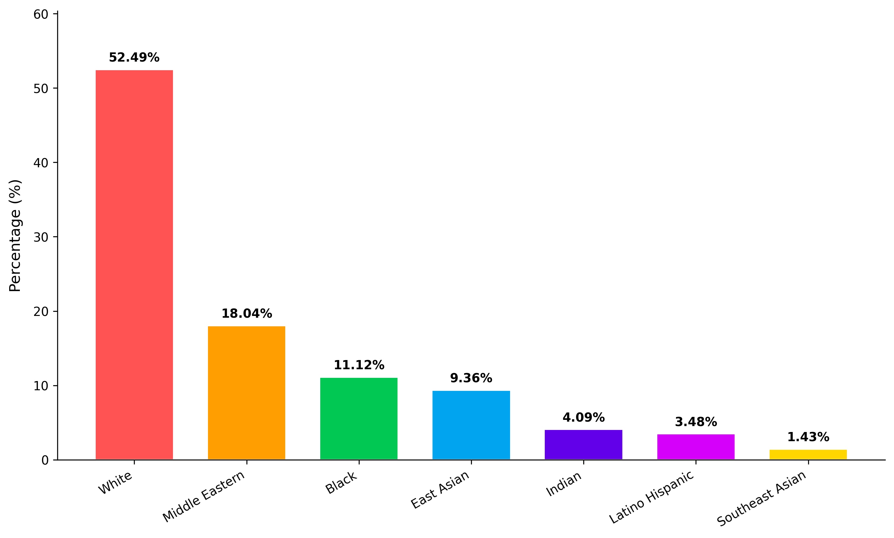

<div align="center">

# TVFace Dataset
### Large-Scale Facial Clustering & Recognition Dataset

[Research Paper](https://doi.org/10.1007/s10044-025-01464-3) · [Dataset (Google Drive)](https://drive.google.com/drive/folders/1GBJs96fE6qbef8VGurz4q3DvN4s_pXDw?usp=sharing)

[](https://creativecommons.org/licenses/by-nc/4.0/)
[](https://doi.org/10.1007/s10044-025-01464-3)

<p align="center">
  
</p>

</div>


## Overview

TVFace is the largest publicly available facial recognition dataset featuring **2.6 million+ images** of **28,955 unique individuals** extracted from global television broadcasts. Designed to advance research in unsupervised facial clustering, large-scale recognition, and demographic fairness analysis, this dataset captures real-world variations in pose, lighting, expression, and aging effects across diverse demographics.

## Key Features

- **Unprecedented Scale**: 2,609,210 high-resolution face images
- **Demographic Diversity**: Balanced representation across 7 ethnic groups and 8 age categories
- **Rich Annotations**: Probabilistic labels for age, gender, ethnicity, expression, and head pose
- **Real-world Variations**: Temporal changes, pose diversity, and broadcast-quality images
- **Long-tail Distribution**: Natural identity distribution from 10 to 21,983 images per person
- **Benchmark Ready**: Standardized evaluation protocols for clustering and recognition tasks

## Dataset Statistics

| Category | Details |
|----------|---------|
| **Total Images** | 2,609,210 |
| **Unique Identities** | 28,955 |
| **Avg. Images/Identity** | 90 |
| **Resolution** | 224×224 pixels |
| **Ethnic Groups** | 7 (White, Black, East Asian, Middle Eastern, Indian, Latino, SE Asian) |
| **Age Groups** | 8 (0-2 to 70+) |
| **Expressions** | 7 categories with confidence scores |


## Demographic Distribution

<table>
<tr>
<td width="45%">

| **Gender** | Count | Percentage |
|------------|-------|------------|
| Male | 1,714,636 | 65.71% |
| Female | 894,574 | 34.29% |

</td>
<td width="55%">

</td>
</tr>
</table>

## Ethnicity Distribution

| **Ethnicity** | Count | Percentage |
|---------------|-------|------------|
| White | 1,369,323 | 52.49% |
| Middle Eastern | 470,658 | 18.04% |
| Black | 290,143 | 11.12% |
| East Asian | 244,298 | 9.36% |
| Indian | 106,753 | 4.09% |
| Latino Hispanic | 90,758 | 3.48% |
| Southeast Asian | 37,277 | 1.43% |



## Expression Distribution

| **Expression** | **Count** | **Percentage** | **Avg. Confidence** |
|----------------|-----------|----------------|---------------------|
| Neutral | 1,048,995 | 39.39% | 0.790 |
| Sad | 464,547 | 17.44% | 0.684 |
| Happy | 464,049 | 17.42% | 0.867 |
| Angry | 363,260 | 13.64% | 0.717 |
| Fear | 268,530 | 10.08% | 0.674 |
| Surprise | 47,920 | 1.8% | 0.716 |
| Disgust | 6,072 | 0.23% | 0.640 |


## Head Pose Statistics

| **Pose Component** | **Mean (degrees)** | **Std Dev (degrees)** | **Characteristics** |
|--------------------|--------------------|-----------------------|---------------------|
| Yaw (Left-Right) | 0.43 | 23.47 | Wide variation, all angles |
| Pitch (Up-Down) | -4.27 | 9.25 | Slight downward (camera angle) |
| Roll (Tilt) | -0.997 | 7.98 | Nearly level, small variations |


## Directory Structure

### Google Drive Dataset Structure
The TVFace dataset available for download is organized by TV channels:

```
tvface_dataset/
├── abc_news/
│   ├── abcnews_frame_20211215180237107908_face_0.jpg
│   └── ...
├── skynews/
│   ├── skynews_frame_2021121518232343208_face_0.jpg
│   └── ...
├── aljazeera/
│   └── ...
├── euronews/
│   └── ...
├── [18 other channels]/
│   └── ...
annotations.json  # Contains annotations for all 2.6M images across all channels
```

- **22 Television Channels**: The dataset includes faces extracted from 22 global broadcast channels including ABC News, Sky News, Al Jazeera, and others
- **File Naming Convention**: Each image is named with the format `[channel]_frame_[timestamp]_face_[face_index].jpg`
- **Image Size**: Each image is 224 x 224 pixels
- **Unified Annotations**: A single `annotations.json` file contains metadata for all 2.6 million images across all channels

### Annotation Format (annotations.json)

```json
{
  "labels": {
    "abcnews_frame_20211215180237107908_face_0": {
      "label": 83,
      "mask": 0.0,
      "attributes": {
        "age": {
          "0-2": 0.0,
          "3-9": 0.0,
          "10-19": 0.0,
          "20-29": 0.0,
          "30-39": 0.0,
          "40-49": 0.01,
          "50-59": 0.18,
          "60-69": 0.68,
          "70+": 0.13
        },
        "gender": {
          "Male": 1.0,
          "Female": 0.0
        },
        "race": {
          "White": 0.38,
          "Black": 0.0,
          "Latino Hispanic": 0.0,
          "East Asian": 0.0,
          "Southeast Asian": 0.0,
          "Indian": 0.0,
          "Middle Eastern": 0.61
        },
        "expression": {
          "angry": 0.08,
          "disgust": 0.01,
          "fear": 0.14,
          "happy": 0.0,
          "sad": 0.63,
          "surprise": 0.0,
          "neutral": 0.13
        },
        "pose": {
          "yaw": -3.26,
          "pitch": -4.65,
          "roll": -0.83
        }
      }
    }
  }
}
```

### Annotation Schema

| **Field** | **Description** | **Type** |
|-----------|-----------------|----------|
| `label` | Identity cluster label | Integer |
| `mask` | Exclusion flag (0.0 = include, 1.0 = exclude) | Float |
| `age` | Probability distribution over age groups | Dict[str, float] |
| `gender` | Gender probabilities | Dict[str, float] |
| `race` | Ethnicity probabilities | Dict[str, float] |
| `expression` | Expression probabilities | Dict[str, float] |
| `pose` | Head pose angles in degrees | Dict[str, float] |

## Getting Started

### Installation

```bash
git clone https://github.com/zaineli/TVFace.git
cd TVFace-Dataset
pip install -r requirements.txt
```

### Merging Channel Data

When you download the TVFace dataset from Google Drive, the images are organized by TV channels. To simplify processing, you'll want to merge all face images into a single directory. Use this script:

Run this script to merge all face images:

```bash
python merge_faces.py
```

This will create a new directory `tvface_dataset/faces` containing all face images from all 22 channels, while preserving the original directory structure.

### Data Loading

```python
from tvface_dataset import TVFaceDataset
import torchvision.transforms as transforms
import json

# loading dataset with transforms
transform = transforms.Compose([
    transforms.Resize((256, 256)),
    transforms.ToTensor(),
    transforms.Normalize(mean=[0.485, 0.456, 0.406], 
                        std=[0.229, 0.224, 0.225])
])

dataset = TVFaceDataset(
    img_dir='path/to/tvface_dataset/faces',  # Point to the merged faces directory
    annotation_path='path/to/tvface_dataset/annotations.json',
    transform=transform
)

# getting sample with annotations
sample = dataset[0]
print(f"Image shape: {sample['image'].shape}")
print(f"Identity label: {sample['label']}")
print(f"Gender: {sample['gender']}")
print(f"Race: {sample['race']}")
print(f"Expression: {sample['expression']}")
```

### Accessing Demographic Statistics

```python
from statistics.calculate_statistics import compute_statistics
from tvface_dataset import TVFaceDataset
import torchvision.transforms as T

# initializing dataset
transform = T.Compose([T.ToTensor()])
dataset = TVFaceDataset(
    img_dir='path/to/tvface_dataset',
    annotation_path='path/to/annotations.json',
    transform=transform
)

# computing statistics
stats = compute_statistics(dataset)

# printing results
print("=== Age Distribution ===")
for k, v in stats['age_distribution'].items():
    print(f"{k}: {v} ({v/len(dataset)*100:.2f}%)")

print("\n=== Gender Distribution ===")
for k, v in stats['gender_distribution'].items():
    print(f"{k}: {v} ({v/len(dataset)*100:.2f}%)")
```

### Working with Identity Clusters

```python
import json
from collections import defaultdict

# loading annotations
with open('tvface_dataset/annotations/annotations.json', 'r') as f:
    annotations = json.load(f)

# grouping images by identity
identity_clusters = defaultdict(list)
for image_id, data in annotations['labels'].items():
    if data['mask'] == 0.0:  # Include only valid images
        identity_clusters[data['label']].append(image_id)

# analyzing cluster sizes
cluster_sizes = [len(images) for images in identity_clusters.values()]
print(f"Total identities: {len(identity_clusters)}")
print(f"Average cluster size: {sum(cluster_sizes) / len(cluster_sizes):.1f}")
print(f"Largest cluster: {max(cluster_sizes)} images")
print(f"Smallest cluster: {min(cluster_sizes)} images")
```

## Dataset Challenges and Applications

<table>
<tr>
<td width="50%">

<h3>Key Challenges</h3>
<ul>
<li><strong>Scale</strong>: Efficiently processing 2.6 million+ images</li>
<li><strong>Long-tail Distribution</strong>: Handling clusters ranging from 10 to 21,983 images</li>
<li><strong>Temporal Variations</strong>: Same individuals across multiple years</li>
<li><strong>Pose Diversity</strong>: Full 360° coverage with professional TV angles</li>
<li><strong>Demographic Fairness</strong>: Ensuring equitable performance across all groups</li>
</ul>

</td>
<td width="50%">

<h3>Research Applications</h3>
<ul>
<li><strong>Unsupervised Face Clustering</strong>: Organize large-scale unlabeled face datasets</li>
<li><strong>Face Recognition</strong>: Train and evaluate recognition systems</li>
<li><strong>Demographic Bias Analysis</strong>: Study fairness across different groups</li>
<li><strong>Temporal Face Analysis</strong>: Research aging effects and temporal consistency</li>
<li><strong>Large-scale Retrieval</strong>: Develop efficient face search systems</li>
</ul>

</td>
</tr>
</table>

## Ethical Considerations

TVFace is intended for **research purposes only**. Users must adhere to:

- **Privacy Protection**: Implement appropriate anonymization procedures
- **Non-commercial Use**: Restricted to academic and research applications
- **Bias Mitigation**: Consider demographic fairness in all applications
- **Ethics Review**: Obtain institutional ethics approval before use
- **Responsible AI**: Follow established ethical AI principles

All facial images are derived from publicly broadcast television content with appropriate anonymization procedures applied.


## Download and Access

### Dataset Access
The TVFace dataset is available for download through the following Google Drive folder:

- **Google Drive**: [https://drive.google.com/drive/folders/1GBJs96fE6qbef8VGurz4q3DvN4s_pXDw?usp=sharing](https://drive.google.com/drive/folders/1GBJs96fE6qbef8VGurz4q3DvN4s_pXDw?usp=sharing)

### System Requirements
- **Storage**: 65GB Free Disk Space Required
- **Memory**: 16GB RAM Recommended

## Citation

If you use TVFace in your research, please cite:

```bibtex
@article{khurshid2025tvface,
  title={TVFace: towards large-scale unsupervised face recognition in video streams},
  author={Khurshid, Atif and Khan, Bostan and Shahzad, Muhammad and Fraz, Muhammad Moazam},
  journal={Pattern Analysis and Applications},
  volume={28},
  number={2},
  pages={1--21},
  year={2025},
  publisher={Springer},
  doi={10.1007/s10044-025-01464-3}
}
```

## License

This dataset is released under the [Creative Commons Attribution-NonCommercial 4.0 International License](https://creativecommons.org/licenses/by-nc/4.0/).

## Contact

For technical support and research inquiries, you can reach out to us at the following addresses:

- **For General Inquiries & Technical Support**: vision@seecs.edu.pk
- **For Research Collaboration**: moazam.fraz@seecs.edu.pk
- **Website**: [vision.seecs.edu.pk](https://vision.seecs.edu.pk/)
